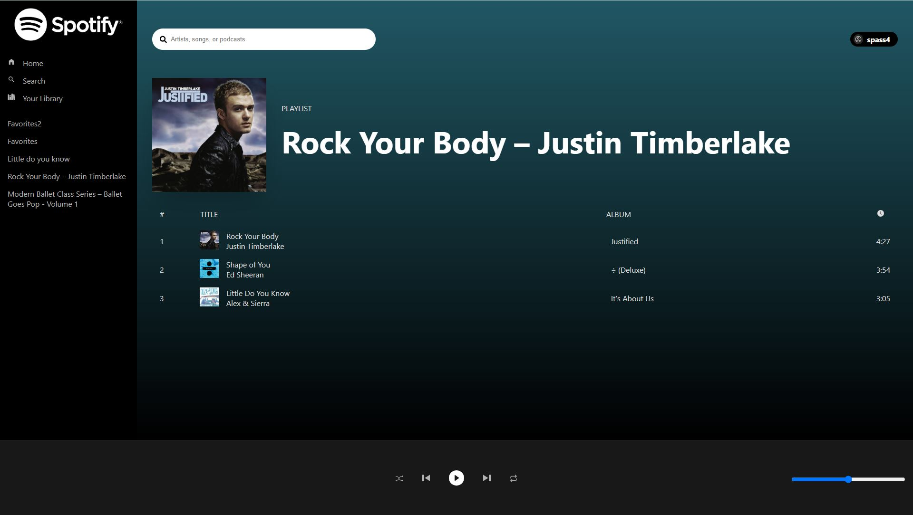

# Spotify Clone
> Using React and Spotify's public API, I created a Spotify clone. User's are
authenticated using Spotify's auth and are able to view their playlists, search
for music, and play songs.

## Table of Contents
* [Technologies Used](#technologies-used)
* [Installing](#installing)
* [Screenshots](#screenshots)
* [Project Status](#project-status)
* [Room for Improvement](#room-for-improvement)
* [Contact](#contact)

## Technologies Used


## Installing

Clone this repo

```
git clone https://github.com/MarlisaRebaum/spotify-clone

cd spotify-clone
```  

#### Available Scripts

```  
npm start
```   

Runs the app in the development mode.\
Open [http://localhost:3000](http://localhost:3000) to view it in the browser.

The page will reload if you make edits.\
You will also see any lint errors in the console.

```  
npm test
```  
Launches the test runner in the interactive watch mode.\
See the section about [running tests](https://facebook.github.io/create-react-app/docs/running-tests) 
for more information.

```  
npm run build
```  
Builds the app for production to the `build` folder.\
It correctly bundles React in production mode and optimizes the build for the best performance.

The build is minified and the filenames include the hashes.\
Your app is ready to be deployed!

See the section about [deployment](https://facebook.github.io/create-react-app/docs/deployment) for more information.

```  
npm run eject
```  

**Note: this is a one-way operation. Once you `eject`, you can’t go back!**

If you aren’t satisfied with the build tool and configuration choices, you can `eject` at any time. This command will remove the single build dependency from your project.

Instead, it will copy all the configuration files and the transitive dependencies (webpack, Babel, ESLint, etc) right into your project so you have full control over them. All of the commands except `eject` will still work, but they will point to the copied scripts so you can tweak them. At this point you’re on your own.

You don’t have to ever use `eject`. The curated feature set is suitable for small and middle deployments, and you shouldn’t feel obligated to use this feature. However we understand that this tool wouldn’t be useful if you couldn’t customize it when you are ready for it.

## Screenshots



## Project Status
Project is:  _in progress_ 

## Room for Improvement
Some areas of improvement include:

- Although the playlists load, there is an issue with the GET functions that 
allows users to actually play the songs. The songs will not always play.
- The search function is not currently working.

## Contact
Created by [Marlisa Rebaum](https://www.linkedin.com/in/marlisarebaum/) - feel free to contact me!
